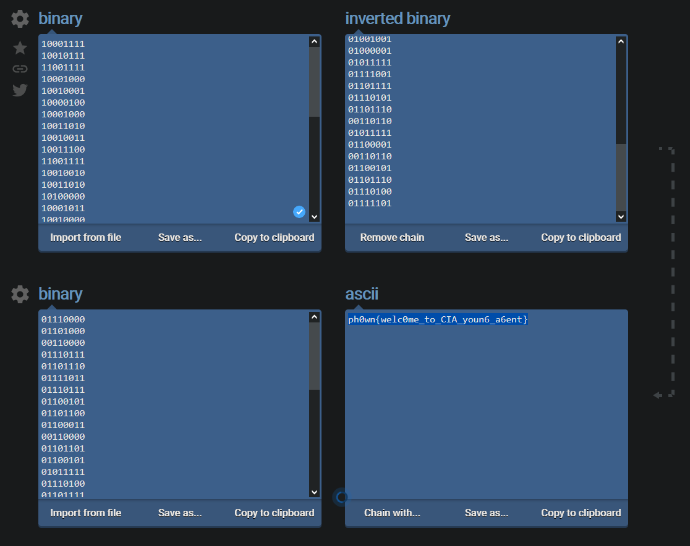

Visualisation du code source de la page, puis ouverture du fichier
``` HTML
<script src="login.js"></script>
```

`login.js`

```javascript
if (Username == "NewCIAAgent" && Password == "IlovePh0wnbec@useitss0fun" )
```

---

Login with `NewCIAAgent` and `IlovePh0wnbec@useitss0fun`

---

Dans le source de la nouvelle page HTML on a:

``` HTML
 </body>
<hide "You're pretty smart if you're reading this message: 10001111 10010111 11001111 10001000 10010001 10000100 10001000 10011010 10010011 10011100 11001111 10010010 10011010 10100000 10001011 10010000 10100000 10111100 10110110 10111110 10100000 10000110 10010000 10001010 10010001 11001001 10100000 10011110 11001001 10011010 10010001 10001011 10000010. Be careful, 0 and 1 might have been exchanged... " >
  </html>
```
---
On utilise les outils de conversion en ligne: https://onlinebinarytools.com/invert-binary-values
1. On aligne chacun des codes binaires les uns sous les autres
2. `inverted binary` réalise l'inversion des bits à la volée
3. On créé une chaine avec `convert Binary to ASCII`; une nouvelle ligne de conversion apparait
4. Et on récupère le drapeau automatiquement :smiley:

__ph0wn{welc0me_to_CIA_youn6_a6ent}__
